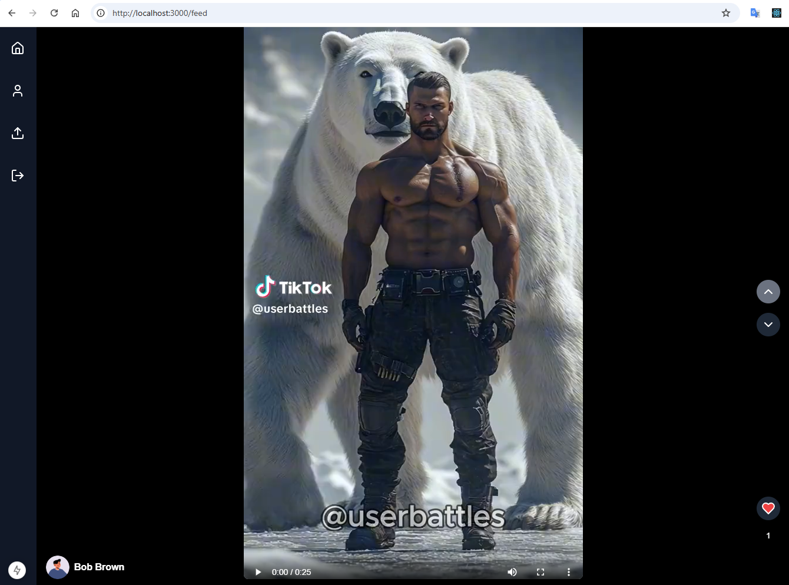

# TikTok Clone with Next.js, Drizzle ORM, Neon, and Upstash Redis

This repository contains a **TikTok-like** short-form video application built using **Next.js**, **Drizzle ORM** (
connecting to a **Neon** PostgreSQL database), and **Upstash Redis** for caching recommendations. The app features a
vertical video feed, user interactions (likes, views, watch times), and a recommendation system.

## Project Overview

- **Next.js (App Router)**: Frontend + SSR architecture for the TikTok-style interface.
- **Drizzle ORM + Neon**: Manages PostgreSQL tables for `user_profiles`, `videos`, `user_interactions`.
- **Upstash Redis**: Caches recommended video IDs for each user, enabling quick retrieval by the feed API.
- **Collaborative Filtering (Python)**: Offline/scheduled script computes recommendations based on user interactions and stores them in Redis.

---

## Features

### Video Feed
- Scrollable TikTok-like short videos.
- Each video has captions, tags, user ID, likes count, etc.

### User Interactions
- Table `user_interactions` tracks likes, views, watch times, etc.
- CF logic uses Python to generate a user-based similarity matrix and recommend unseen videos.

### Redis Caching
- A Python job (see **`recommend_scheduler.py`**) runs every few minutes using APScheduler.
- Computes recommended videos, pushing them to Upstash Redis under `recommendations:userId`.
- The Next.js feed reads these cached video IDs for a fast, personalized feed experience.

